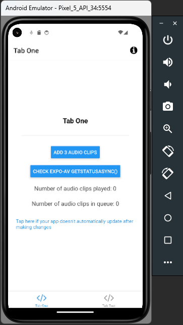
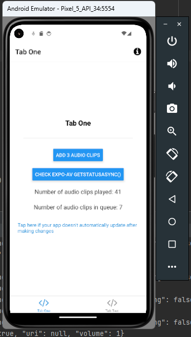
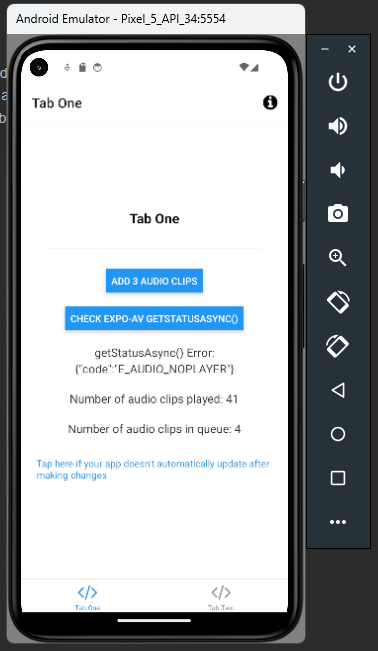

# React-Native-Expo-Audio-Test-App
Expo test app to display expo-av Audio crash.

## Setup
- Clone project locally
- Install dependencies using `bun install`
- Run project using `bunx expo start`
- Launch the project in an android emulator by pushing `a`

## Android
The Audio player usually crashes after 41 plays.

### Steps to Recreate
- Make sure volume is turned up
- When presented with this UI:

- Use the "Add 3 Audio clips" button to cue up ~ 50 clips
- Observe process as it plays the Audio clips serially
- Happy Case: Player plays through the total amount of audio clips without issue
- Current Scenario (Unhappy Case): Audio player crashes after 41 plays (see crashed state below)

- You can then push the Check expo-av getStatusAsync() button to display (see crashed state with error message below)

## iOS
No observed crash.
